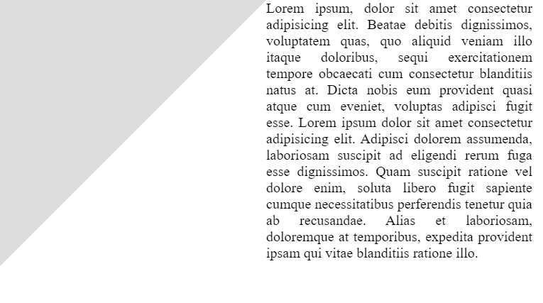
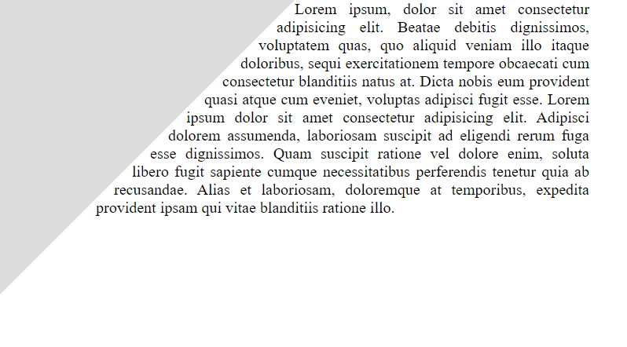

# Ćwiczenie #01

> :loudspeaker: Jeśli chciałbyś więcej tego typu zadań to zapraszam do :moneybag: [wsparcia mojego konta](https://github.com/sponsors/devmentor-pl)!

&nbsp;

Obecnie tekst, który jest wprowadzony do pliku `index.html`, prezentuje się w taki sposób:

Nie wygląda to profesjonalnie. Przestrzeń miedzy "trójkątem", a tekstem należy wypełnić tekstem w taki sposób, aby przy zmianie rozmiaru okna przeglądarki, tekst cały czas opływał "trójkąt".

&nbsp;

> :warning: Jeśli nie posiadasz materiałów do tego zadania to znajdziesz je na stronie [devmentor.pl](https://devmentor.pl/p/html-and-css-rwd/)
