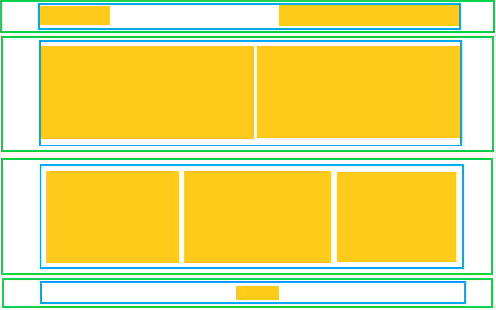

> :star: *Jeśli będziesz mieć problem z rozwiązaniem tego zadania, poproś o pomoc na odpowiednim kanale na Slacku, tj. `s1e03-html-and-css-rwd` (dotyczy [mentee](https://devmentor.pl/mentoring-javascript/) oraz posiadaczy [kursu JavaScript](https://devmentor.pl/p/javascript-for-beginners/)) lub na [dedykowanej grupie fb](https://www.facebook.com/groups/155234921740033). Pamiętaj, aby treść Twojego wpisu spełniała [odpowiednie kryteria](https://devmentor.pl/jak-prosic-o-pomoc/).*

&nbsp;

# `#05` HTML i CSS: Responsywność

Najwyższy czas zakodować układ strony, który będzie posiadał widok *mobilny* oraz *desktopowy*. 
Całość zakodujemy w duchu *mobile first*, a punktem granicznym (ang. *breakpoint*) będzie 800px. 

&nbsp;

&nbsp;

Podobnie jak w zadaniu z modułu *HTML i CSS: Podstawy*:

* **zielone krawędzie** to kontenery, które wypełniają całą szerokość okna przeglądarki (mają 100% szerokości),
* **niebieskie krawędzie** to maksymalna szerokość zawartości naszej strony. Przyjmijmy, że wynosi 1000px,
* **pomarańczowe prostokąty** to dowolna zawartość sekcji.

Zwróć uwagę, że w przypadku widoku mobilnego, krawędzie niebieskie i zielone praktycznie na siebie nachodzą. Można by je pominąć, jednak mając na uwadze widok desktopowy, możemy od razu dodać je do struktury HTML.

## Mobile

### Sekcja nr 1

Posiada menu, które jest wyśrodkowane w poziomie. Z prawej strony jest tzw. hamburger – po jego kliknięciu powinna pojawić się zawartość menu. Całość możemy uznać za nagłówek.

### Sekcja nr 2

Zawiera dwa elementy wyświetlane jeden pod drugiem z niewielkim odstępem między nimi.

### Sekcja nr 3

Podobnie jak w sekcji poprzedniej, tylko tym razem mamy trzy, a nie dwa elementy.

### Sekcja nr 4

To stopka naszej strony, która zwiera jedynie element wyśrodkowany w pionie i poziomie.

&nbsp;

## Desktop

Na desktopie układ jest identyczny jak w [zadaniu 5 z *HTML i CSS: Podstawy*](https://github.com/devmentor-pl/practice-html-and-css-basics/tree/master/05). Pomimo tego wykonaj aktualne zadanie od początku mając na uwadze układ mobilny.

# Zadanie dodatkowe

Teraz możesz spróbować przebudować układ z [zadania 5 z *HTML i CSS: Podstawy*](https://github.com/devmentor-pl/practice-html-and-css-basics/tree/master/05). Zrób to w taki sposób, aby dodać do wcześniej utworzonego widoku desktopowego widok mobilny. Sam ocenisz, które podejście, tj. *mobile first* czy *desktop first*, jest wygodniejsze.

&nbsp;

> :arrow_left: [*poprzednie zadanie*](./../04) | ~~*następne zadanie*~~ :arrow_right:

> :no_entry: *Jeśli nie posiadasz materiałów do tego zadania, znajdziesz je na stronie [devmentor.pl](https://devmentor.pl/p/html-and-css-rwd/)*
