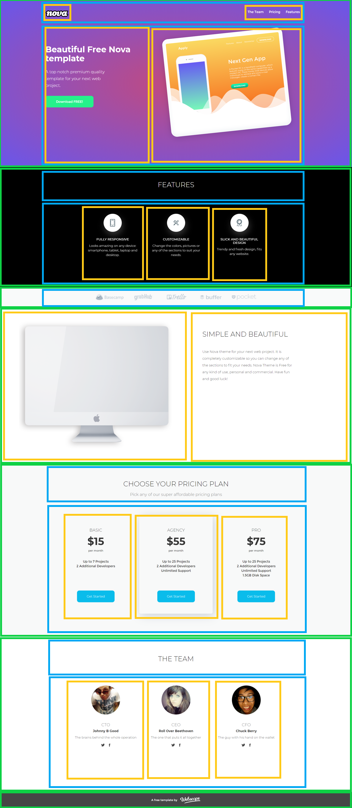

# Ćwiczenie #05

> :loudspeaker: Jeśli chciałbyś więcej tego typu zadań to zapraszam do :moneybag: [wsparcia mojego konta](https://github.com/sponsors/devmentor-pl)!

&nbsp;

Najwyższy czas zakodować prawdziwą stronę internetową! 

Będziemy się wzorować na projekcie od chłopaków z [Webscope](https://webscopeapp.com/), który wygląda tak:

&nbsp;

## Opis projektu

Wszystkie niezbędne grafiki masz przygotowane w katalogu `images`. Znajdziesz tam m. in. [pliki SVG](https://pl.wikipedia.org/wiki/Scalable_Vector_Graphics). Ich podgląd w VS Code możesz wykonać dzięki rozszerzeniu [SVG Viewer](https://marketplace.visualstudio.com/items?itemName=cssho.vscode-svgviewer).

Font, który jest używany w projekcie to [Montserrat](https://fonts.google.com/specimen/Montserrat).

Tło które widać w górnej części strony to gradient: 
`background: radial-gradient(rgb(194, 74, 126), rgb(105, 86, 235));`

Proponuję dla wygody użyć rozszerzenie do Chrome o nazwie [PerfectPixel](https://chrome.google.com/webstore/detail/perfectpixel-by-welldonec/dkaagdgjmgdmbnecmcefdhjekcoceebi), który pozwoli Ci osadzić plik poglądowy, przedstawiony wyżej (lokalizacja: `./assets/demo.png`) jako tło dla renderowanej strony, co uławi Ci kodowanie.

Projekt nie musi być wykonany zgodnie z pierowzrorem 1:1. Ważne, aby na pierwszy rzut oka było widać, że jest to dokładne odwzorowanie.

## Propozycja podziału

Poniżej zamieszczam propozycję podziału strony na poszczególne grupy, gdzie:

- wiersz (`width: 100%`), kolor zielony
- wyśrodkowanie (`max-width: 1050px`), kolor niebieski niebieski
- komórka (wiele elementów w jednej linii), pomarańczowy

Nie musisz się od nich stosować to jedynie moja koncepcja, która ma Ci pomóc utworzyć odpowiednią strukturę.

&nbsp;

> :warning: Jeśli nie posiadasz materiałów do tego zadania to znajdziesz je na stronie [devmentor.pl](https://devmentor.pl/p/html-and-css-basics/)
