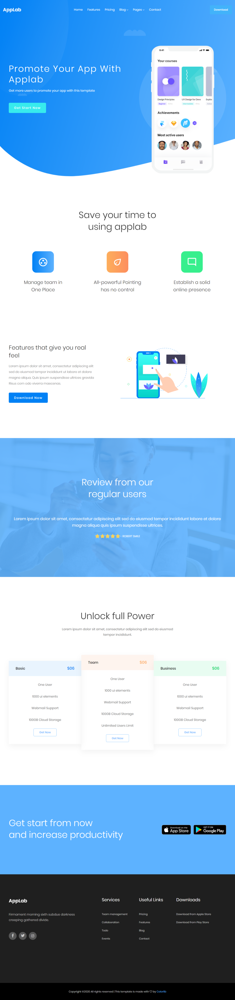

> ⭐ ***README** to coś więcej niż opis. Poprzez nie **pokazujesz swoje mocne strony** – swoją dokładność, sposób myślenia i podejście do rozwiązywania problemów. Niech Twoje README pokaże, że masz **świetne predyspozycje do rozwoju!***
> 
> 🎁 *Zacznij od razu. Skorzystaj z **[szablonu README i wskazówek](https://github.com/devmentor-pl/readme-template)**.* 

&nbsp;

# HTML & CSS: Responsywność (RWD)

Najwyższy czas zakodować stronę, która ma przygotowane 3 widoki dla różnych punktów granicznych (ang. breakpoints):

- mobile
- tablet
- desktop

## Od czego zacząć?

Przeczytaj dokładnie treść, którą zamieszczam poniżej. Następnie zapoznaj się ze zrzutami ekranu, które znajdziesz w katalogu `./assets` prezentujące poszczególne widoki.

Zaznacz sobie na każdym widoku, które elementy to oddzielne sekcje strony. Zwróć uwagę jak się one zmianiają podczas przechodzenia z jednego widoku do drugiego. To ułatwi Ci budowanie układu.

Zacznij od widoku na telefon. Możesz użyć dodatku [PerfectPixel](https://chrome.google.com/webstore/detail/perfectpixel-by-welldonec/dkaagdgjmgdmbnecmcefdhjekcoceebi?hl=pl) do przeglądarki Chrome, aby ułatwić sobie kodowanie. Pamiętaj, że nie warto odzwierciedlać widoku 1:1 co do piksela. Masz zaznajomić się z technikami RWD i przy okazji utrwalić wiedzę z HTML-a i CSS-a. Widok ma być zbliżony z zachowaniem koncepcji i estetyki z odpowiednim dopasowaniem do najważniejszych rozdzielczości. Nie ma być identyczny, a w zasadzie nie może być ponieważ na każdym urządzeniu z innym rozdzielczością będzie się prezetntował trochę inaczje. 

Jeśli będziesz korzystać z PerfectPixel-a pamiętaj również o ustawieniu odpowiedniej skali dla warstwy oraz ustawieniu odpowiedniej szerokości dla okna przeglądarki.

Możesz również skorzystać z dodatku [ColorZilla](https://chrome.google.com/webstore/detail/colorzilla/bhlhnicpbhignbdhedgjhgdocnmhomnp), który pozwoli Ci pobierać kolor ze wskazanego miejsca. Wystarczy wyświetlić obraz w przeglądarce Chrome i użyć wspomnianego rozszerzenia. 

Kiedy skończysz kodować widok dla telefonu, zajmij się widokiem tabletowym. Pamiętaj, aby sprawdzać czy zmiany wprowadzone do widoku tabletowego nie spowodowały zmian w widoku mobilnym.

Po skończeniu kodowania widoku dla tabletu zajmij się desktopem. Ponownie pamiętaj o częstym sprawdzaniu czy czegoś nie popsułeś w poprzednich wersjach. Im wcześniej zorientujesz się, że coś nie działa tym będzie Ci łatwiej to poprawić.

## Zasoby

### Fonty

Font jaki jest wykorzystywany w projekcie to `Poppins`, który znajdziesz w [Google Font](https://fonts.google.com/specimen/Poppins).

### Obrazy

Wszystkie niezbędne obrazy, w tym kształty znajdziesz w katalogu `./images`. 

### Ikony

Ikony mediów społecznościowych znajdujące się w stopce umieść przy pomocy [Font Awesome](https://fontawesome.com/).

## Widoki

Nie podaję dokładnych punktów granicznych, abyś sam ocenił kiedy zrobić przejście.

Poniżej zamieszczam tylko informacje dla jakich rozdzielczości był robiony przedstawiony zrzut ekranu.

### mobile => 600px

### tablet => 900px

### desktop => 1200px

# Zadanie dodatkowe

Najwyższy czas zaprezentować swoje umiejętności znajomym na FB! Być może w ten sposób zdobędziesz swoje pierwsze zlecenie - poważnie! Osoby, które Cię znają, są w stanie bardziej zaufać Tobie niż komuś “z ulicy". Dzięki temu zdobędziesz, tak ważne przy rekrutacji, doświadczenie komercyjne.

## GitHub Pages

GitHub udostępnia funkcjonalność, która nazywa się [GitHub Pages](https://pages.github.com/). W ten sposób możemy "serwować" naszą stronę całkowicie za darmo na podstawie zawartości naszego repozytorium. Możliwość ta dotyczy jedynie stron statycznych korzystających z HTML, CSS i JavaScript - więc również z Reacta. 

Wystarczy, że przejdziesz do [ustawień swojego repozytorium](https://docs.github.com/en/pages/getting-started-with-github-pages/configuring-a-publishing-source-for-your-github-pages-site#choosing-a-publishing-source) i wybierzesz gałąź (branch), która zawiera pliki strony (pewnie będzie to `master` lub `main`). Po minucie czy dwóch strona powinna być już dostępna.

> **Uwaga!** Czasami nawet GitHub ma problemy z własnymi serwerami/usługami i coś może nie działać jak należy. Wtedy wystarczy sprawdzić "status" na [odpowiedniej stronie](https://www.githubstatus.com/). Tego typu rozwiązanie jest dość powszechne.

## Własna domena

Mile widziane (a już na pewno, gdy znajdziesz klienta) będzie posiadanie własnej domeny. Na szczęście GH Pages daje możliwość jej podpięcia.

Koszt domeny to zaledwie kilkanaście złotych w pierwszym roku, a jej przedłużenie na kolejny rok to zazwyczaj mniej niż 99zł (zależy od końcówki). Taką domenę możesz zakupić np. w [seohost.pl](https://seohost.pl/?ref=22965).

> **Uwaga!** Nieuczciwe firmy oferują domeny w bardzo atrakcyjnych cenach za pierwszy rok, ale nadrabiają to kosztem przedłużenia, które musisz wykonać, jeśli chcesz zatrzymać domenę. Przeczytaj dokładnie regulamin, zanim dokonasz zakupu.

Domena to nazwa, która wskazuje na konkretny serwer, na którym znajdują się pliki naszej strony internetowej. Wspomniane wskazanie jest realizowane przez [DNS](https://pl.wikipedia.org/wiki/Domain_Name_System).

Jak przeczytamy w [dokumentacji GH Pages](https://docs.github.com/en/pages/configuring-a-custom-domain-for-your-github-pages-site/managing-a-custom-domain-for-your-github-pages-site#configuring-a-subdomain), możemy użyć [domeny](https://docs.github.com/en/pages/configuring-a-custom-domain-for-your-github-pages-site/managing-a-custom-domain-for-your-github-pages-site#configuring-an-apex-domain) lub [subdomeny](https://docs.github.com/en/pages/configuring-a-custom-domain-for-your-github-pages-site/managing-a-custom-domain-for-your-github-pages-site#configuring-a-subdomain) (jeśli kupimy np. domenę devmentor.pl, to jej subdomeną będzie np. rwd.devmentor.pl). Aby to zrobić, musimy dodać odpowiedni rekord w ustawieniach DNS. Sposób wykonania tego zadania zależy od dostawcy domeny i jego panelu administracyjnego. W seohost możesz to zrobić w [taki sposób](https://seohost.pl/pomoc/konfiguracja-rekordow-dns-domeny). Jeśli sobie nie poradzisz, to support (pomoc techniczna) na pewno Ci pomoże. Zawsze byli dla mnie pomocni.

> **Uwaga!** Dokonanie zmian w DNS (propagacja informacji) może trwać nawet 24h (często po paru godzinach "już działa"), dlatego wygodnie jest to robić wieczorem, aby rano mieć już sprawę załatwioną.

# Prawa autorskie

Wszelkie prawa autorskie oraz pokrewne do szablonu i elementów wchodzacych w jego skład należą do [colorlib.com](https://colorlib.com).
Szablon i jego elementy mogą być wykorzystywane na zasadach zgodnych z [licencją](https://colorlib.com/wp/licence/).

&nbsp;

> ⭐ ***README** to coś więcej niż opis. Poprzez nie **pokazujesz swoje mocne strony** – swoją dokładność, sposób myślenia i podejście do rozwiązywania problemów. Niech Twoje README pokaże, że masz **świetne predyspozycje do rozwoju!***
> 
> 🎁 *Zacznij od razu. Skorzystaj z **[szablonu README i wskazówek](https://github.com/devmentor-pl/readme-template)**.* 

